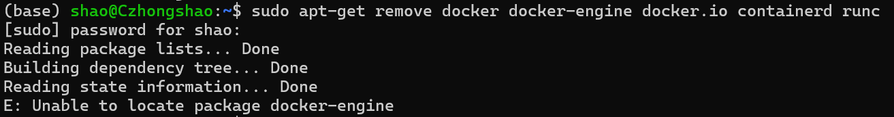

# 基于Ubuntu22.04安装Docker

## 一、准备阶段

### 1. 卸载Ubuntu可能自带的docker

```bash
sudo apt-get remove docker docker-engine docker.io containerd runc
```



### 2. 安装必要支持

```bash
sudo apt install apt-transport-https ca-certificates curl software-properties-common gnupg lsb-release
```


### 3. 添加 Docker GPG key

Docker 官方 key

```bash
curl -fsSL https://download.docker.com/linux/ubuntu/gpg | sudo gpg --dearmor -o /usr/share/keyrings/docker-archive-keyring.gpg
```

阿里源 key

```bash
curl -fsSL https://mirrors.aliyun.com/docker-ce/linux/ubuntu/gpg | sudo gpg --dearmor -o /usr/share/keyrings/docker-archive-keyring.gpg
```

### 4. 添加 apt 源

Docker 官方源

```bash
echo "deb [arch=$(dpkg --print-architecture) signed-by=/usr/share/keyrings/docker-archive-keyring.gpg] https://download.docker.com/linux/ubuntu $(lsb_release -cs) stable" | sudo tee /etc/apt/sources.list.d/docker.list > /dev/null
```

阿里 apt 源

```bash
echo "deb [arch=$(dpkg --print-architecture) signed-by=/usr/share/keyrings/docker-archive-keyring.gpg] https://mirrors.aliyun.com/docker-ce/linux/ubuntu $(lsb_release -cs) stable" | sudo tee /etc/apt/sources.list.d/docker.list > /dev/null
```

### 5. 更新源

```bash
sudo apt update
sudo apt-get update
```

## 二、安装 Docker

### 1. 安装最新版本docker

```bash
sudo apt install docker-ce docker-ce-cli containerd.io
```


### 2. 查看 Docker 版本

```bash
sudo docker version
```


### 3. 安装 Docker 命令补全工具

```bash
sudo apt-get install bash-completion

sudo curl -L https://raw.githubusercontent.com/docker/docker-ce/master/components/cli/contrib/completion/bash/docker -o /etc/bash_completion.d/docker.sh

source /etc/bash_completion.d/docker.sh
```


### 4. 允许非 root 用户执行 docker 命令

- 在docker命令前加上sudo，比如：`sudo docker ps`
- `sudo -i` 切换至 root 用户，再执行 docker 命令

### 5. 添加 Docker 镜像站

```bash
sudo vim /etc/docker/daemon.json
```

修改配置文件，添加下面内容：

```bash
{
    "registry-mirrors": 
    [
        "https://docker.m.daocloud.io",
        "https://noohub.ru",
        "https://huecker.io",
        "https://dockerhub.timeweb.cloud",
        "https://docker.rainbond.cc"
    ]
}
```

重启 Docker 以生效

```bash
sudo systemctl daemon-reload

docker system prune -a

sudo systemctl restart docker
```

### 5. 启动并查看 Docker 运行状态

```bash
sudo systemctl start docker

sudo systemctl satus docker
```

### 6. 测试拉取镜像

```bash
sudo docker pull nginx
```

