# 基于Ubuntu22.04安装Git和MiniConda

## 一、安装 Git

### 1. 更换镜像源

```bash
sudo vim /etc/apt/sources.list
```

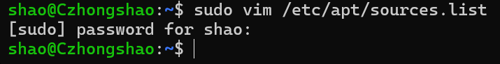

更换为清华大学的镜像源，将前面的内容注释掉后输入：

```bash
deb https://mirrors.tuna.tsinghua.edu.cn/ubuntu/   jammy main restricted universe multiverse
deb https://mirrors.tuna.tsinghua.edu.cn/ubuntu/   jammy-updates main restricted universe multiverse
deb https://mirrors.tuna.tsinghua.edu.cn/ubuntu/   jammy-backports main restricted universe multiverse
deb http://security.ubuntu.com/ubuntu/   jammy-security main restricted universe multiverse
```

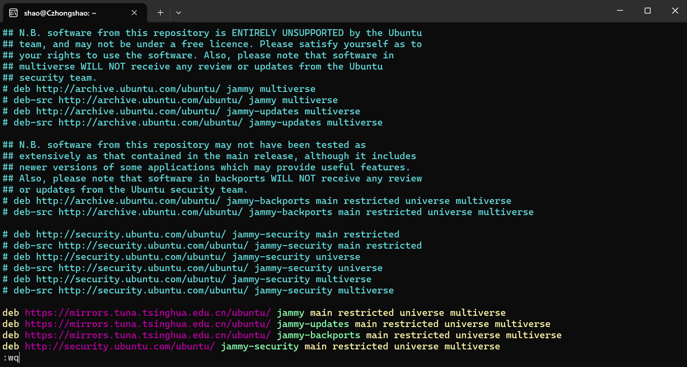

### 2. 更新软件包

```bash
sudo apt update
```

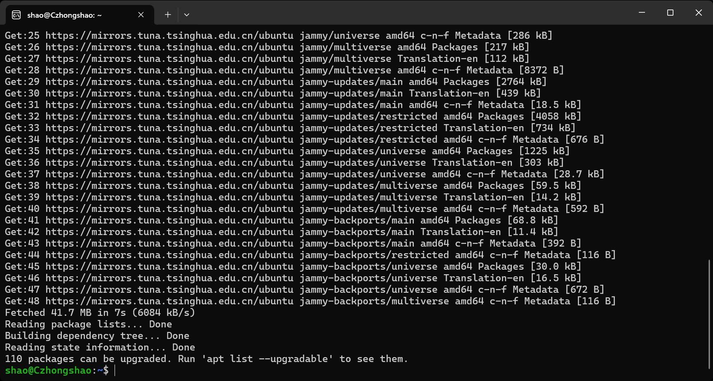

### 3. 安装 Git

```bash
sudo apt install git -y
```

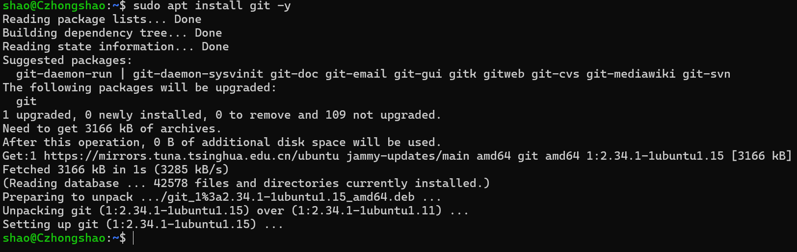

### 4. 配置 Git 用户名和邮箱

```bash
git config --global user.name "Your Name"
git config --global user.email "your.email@example.com"
```

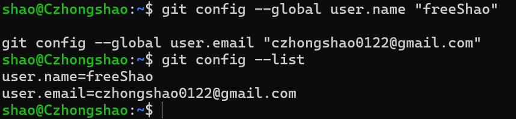

### 5. 配置 SSH 密钥

```bash
ssh-keygen -t rsa -C "your.email@example.com"
```

一路回车默认即可

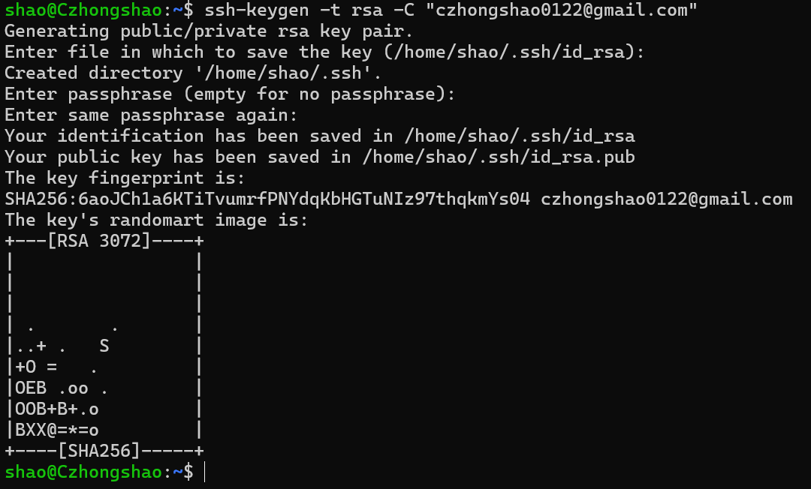

查看生成的 SSH 公共密钥并复制：

```bash
cat ~/.ssh/id_rsa.pub
```

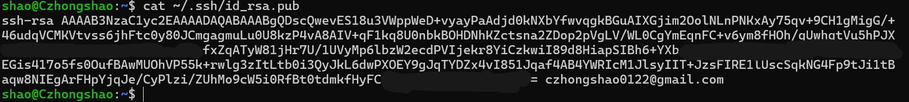

以下为 Github 配置 SSH 密钥的过程：

依次进入：个人主页 → Settings → SSH and GPG keys → New SSH key


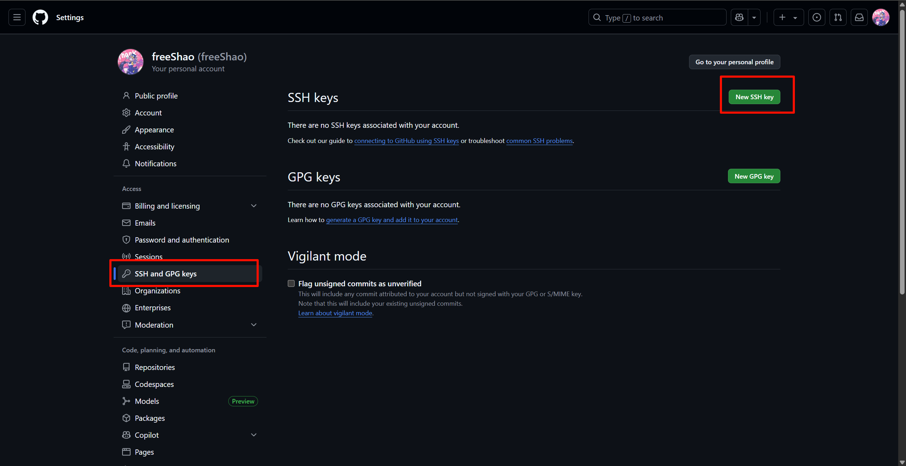

填写标题及 SSH 密钥内容：

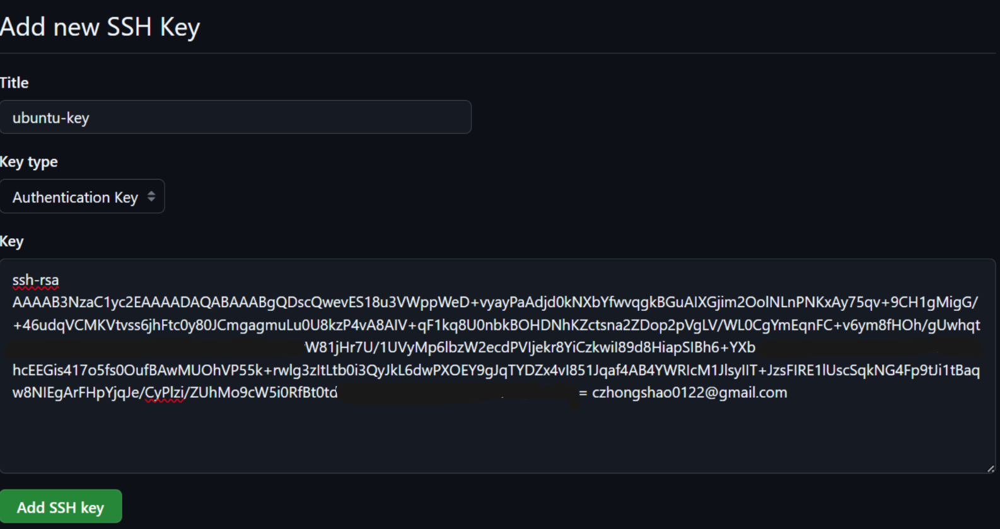

点击 `Add SSH key` 完成添加：

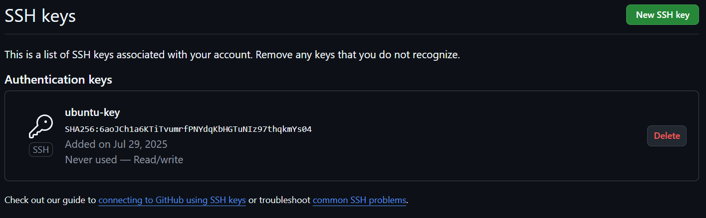

测试 SSH 是否连接成功：

```bash
ssh -T git@github.com
```

> ⚠️注意：如出现错误可能与主机加速器有关，可以关闭后重试。

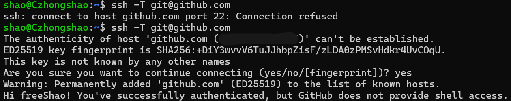

### ✅ Git 常用命令速查表

| 命令                  | 作用             | 示例                                     |
| --------------------- | ---------------- | ---------------------------------------- |
| `git clone <url>`     | 克隆远程仓库     | `git clone git@github.com:user/repo.git` |
| `git status`          | 查看当前状态     | 显示修改、暂存情况                       |
| `git add <file>`      | 添加文件到暂存区 | `git add README.md`                      |
| `git commit -m "msg"` | 提交更改         | `git commit -m "init"`                   |
| `git push`            | 推送到远程仓库   | `git push origin main`                   |
| `git pull`            | 拉取远程更新     | `git pull origin main`                   |
| `git config --list`   | 查看配置         | 列出所有Git配置项                        |


---

## 二、安装 MiniConda

### 1. 查看当前 Python 版本

```bash
python --version
```

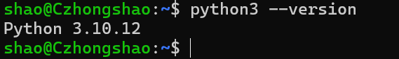

### 2. 下载 MiniConda 安装脚本

#### 官方源：

```bash
wget https://repo.anaconda.com/miniconda/Miniconda3-latest-Linux-x86_64.sh  
```

#### 国内源（推荐）：

```bash
wget https://mirrors.tuna.tsinghua.edu.cn/anaconda/miniconda/Miniconda3-latest-Linux-x86_64.sh  
```

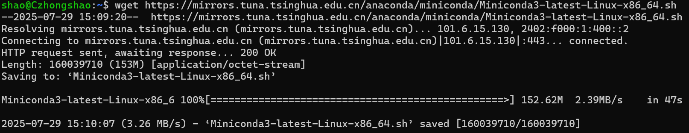

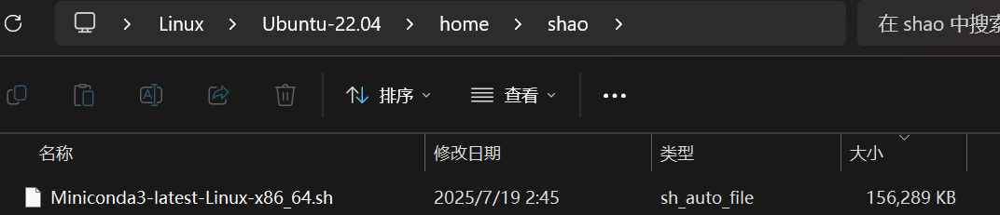

### 3. 安装 MiniConda

```bash
bash Miniconda3-latest-Linux-x86_64.sh
```

过程：回车 → yes → 回车 → yes

默认安装路径：`/home/yourname/miniconda3/`

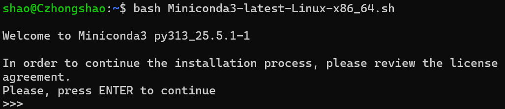
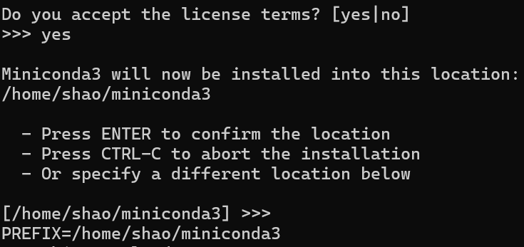
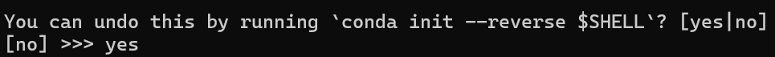

### 4. 添加环境变量

```bash
vim ~/.bashrc
```

添加如下内容：

```bash
export PATH="/home/yourname/miniconda3/bin:$PATH"
```

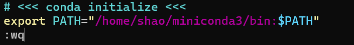

刷新配置：

```bash
source ~/.bashrc
```

### 5. 验证 conda 是否安装成功

```bash
conda --version
```

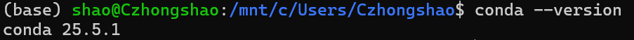

### 6. 添加国内镜像源（中科大）

```bash
conda config --add channels https://mirrors.ustc.edu.cn/anaconda/pkgs/main  
conda config --add channels https://mirrors.ustc.edu.cn/anaconda/pkgs/free  
```

查看配置源：

```bash
conda config --show channels
```

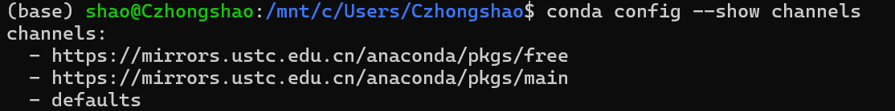

### ✅ Conda 常用命令速查表

| 命令                                | 作用               | 示例                            |
| ----------------------------------- | ------------------ | ------------------------------- |
| `conda create -n myenv python=3.10` | 创建新环境         | 创建一个名为 myenv 的Python环境 |
| `conda activate myenv`              | 激活环境           | 使用 myenv 环境                 |
| `conda deactivate`                  | 退出当前环境       | 从任何环境切换回 base           |
| `conda env list`                    | 列出所有环境       | 查看当前系统中的 Conda 环境     |
| `conda install numpy`               | 安装包             | 安装 numpy 包                   |
| `conda remove numpy`                | 卸载包             | 卸载 numpy 包                   |
| `conda list`                        | 查看环境中已安装包 | 列出当前环境中的所有包          |

---