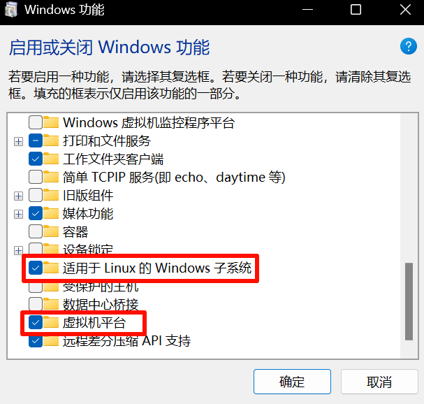
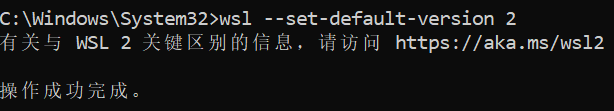
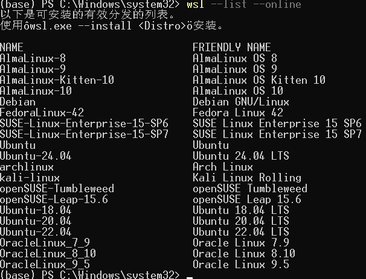
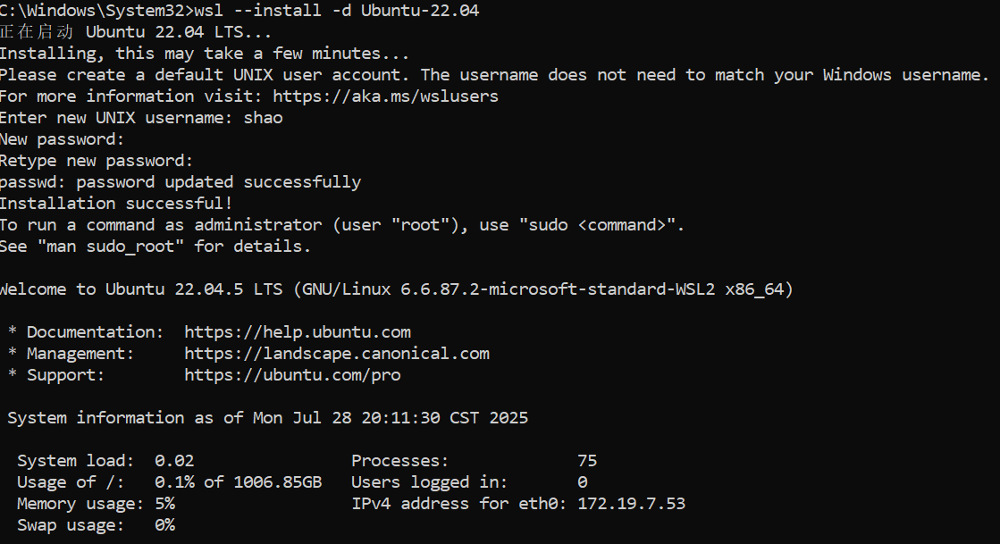
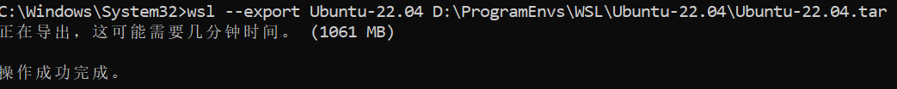
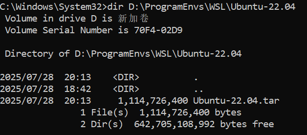
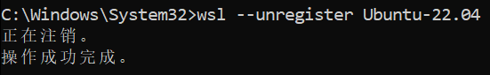
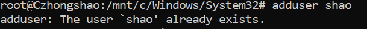
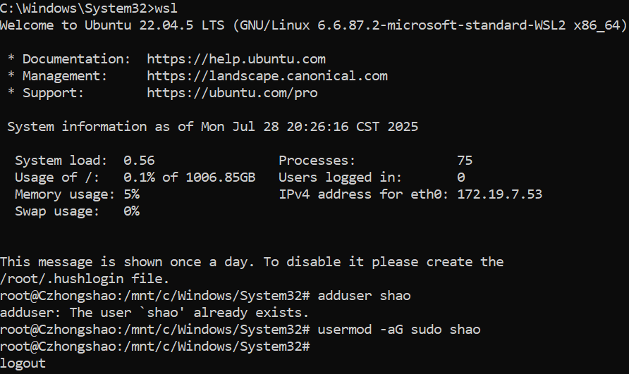
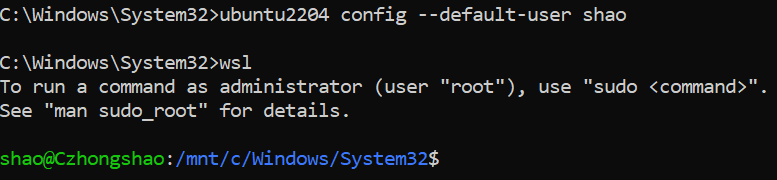

# 基于 WSL2 的 Ubuntu 22.04 配置

## 一、安装 WSL2

### 1. 下载 WSL 并开启虚拟化

- 打开**控制面板**，选择 **程序** > **启用或关闭 Windows 功能**，勾选以下两项：
  

### 2. 将 WSL 默认版本设置为 WSL2

- 打开命令提示符，输入以下命令：

  ```cmd
  wsl --set-default-version 2
  ```

  

## 二、WSL2 安装 Ubuntu-22.04 至 D 盘（方法一 | 推荐）

### 1. 创建文件夹

- 在 `D` 盘（最好非 `C` 盘）创建 **WSL** 文件夹，并在该文件夹下创建 **Ubuntu-22.04** 文件夹。
  

### 2. 下载并导出 Ubuntu-22.04

#### （1）查看可用的 WSL 发行版

- 打开命令提示符，输入以下命令：

  ```cmd
  wsl --list --online
  ```

  

#### （2）安装 Ubuntu-22.04

- 输入以下命令进行安装：

  ```cmd
  wsl --install -d Ubuntu-22.04
  ```

  - 若安装过程中出现错误，可先卸载原版本：

    ```cmd
    wsl --unregister Ubuntu-22.04
    ```

  - 安装完毕后会要求创建一个新用户，按照提示输入用户名和密码，然后按 `Ctrl + D` 退出。
    

#### （3）导出 Ubuntu-22.04 为 `.tar` 文件

- 输入以下命令：

   ```cmd
   wsl --export Ubuntu-22.04 D:\ProgramEnvs\WSL\Ubuntu-22.04\Ubuntu-22.04.tar
   ```

   

  - 可以执行以下命令查看 `Ubuntu-22.04.tar` 是否成功导出：

    ```cmd
    dir D:\ProgramEnvs\WSL\Ubuntu-22.04
    ```

    或

    ```bash
    ls D:\ProgramEnvs\WSL\Ubuntu-22.04
    ```

      

#### （4）取消注册原有的 Ubuntu-22.04

- 如果你已经安装了 Ubuntu-22.04（默认在 `C` 盘），可以将其从 WSL 注销：

   ```cmd
   wsl --unregister Ubuntu-22.04
   ```

   

### 3. 导入 Ubuntu-22.04 到 D 盘

- 运行以下命令，将 Ubuntu-22.04 重新导入到 `D:\ProgramEnvs\WSL\Ubuntu-22.04`：

  ```cmd
  wsl --import Ubuntu-22.04 D:\ProgramEnvs\WSL\Ubuntu-22.04 D:\ProgramEnvs\WSL\Ubuntu-22.04\Ubuntu-22.04.tar --version 2
  ```

  - 这将会把 Ubuntu-22.04 安装到 `D` 盘，而不是默认的 `C` 盘。

### 4. 启动 Ubuntu-22.04

- 导入完成后，可以启动 WSL：

   ```cmd
   wsl
   ```

   或

   ```cmd
   wsl -d Ubuntu-22.04
   ```

  - 此时，你会发现默认以 `root` 用户登录，因为 WSL 手动导入的 Ubuntu 不会自动创建普通用户，需要我们手动创建（如果之前创建过了可以检查一下再跳过）。

#### （1）创建新用户

- 在 WSL 终端（默认 `root`）下运行：

  ```bash
  adduser yourusername
  ```

   

  - 系统会要求你输入（如果是之前填写过的，那么可以跳过）：
    - 新密码
    - 用户信息（全部可以直接回车跳过）

#### （2）赋予新用户 `sudo` 权限

- 输入以下命令：

  ```bash
  usermod -aG sudo yourusername
  ```

  
  - 这样，新用户就可以使用 `sudo` 进行管理员操作。

### 5. 修改默认登录用户为普通用户（可选）

- 以管理员身份运行 cmd，执行命令：

  ```cmd
  ubuntu2204 config --default-user yourusername
  ```

- 再次启动 WSL：

  ```cmd
  wsl
  ```

  或

  ```cmd
  wsl -d Ubuntu-22.04
  ```

  - 此时，你会发现默认以普通用户登录。
    

---
